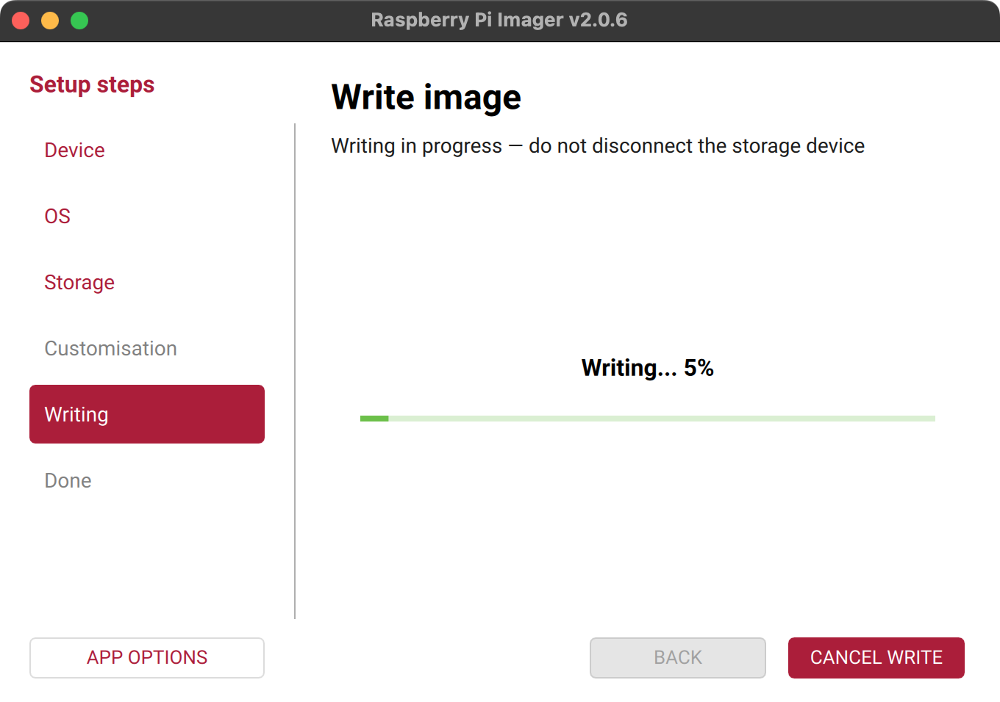
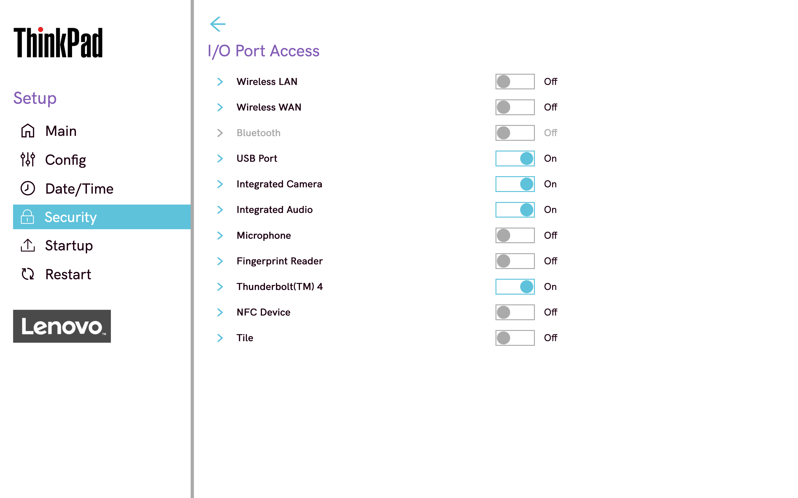
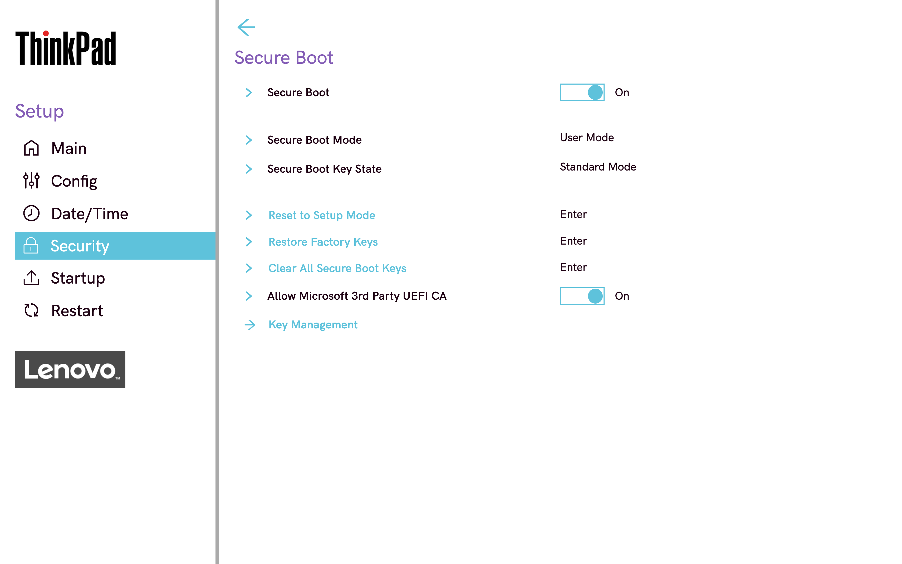
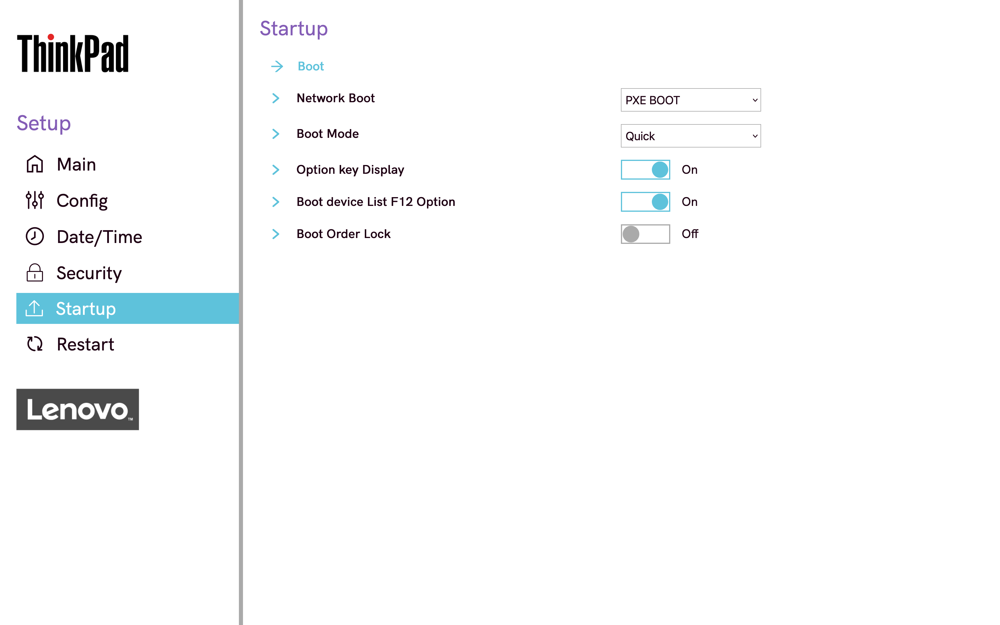
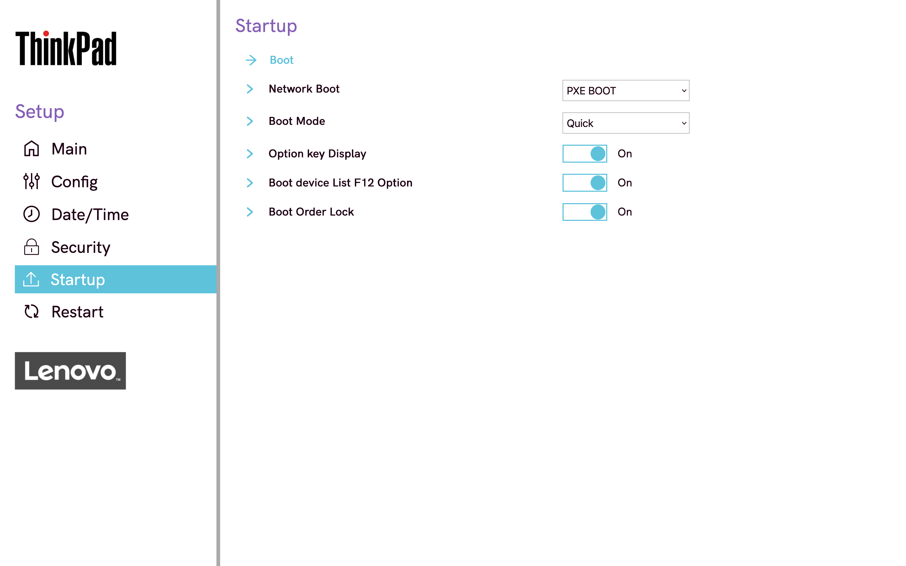

<!--
Title: How to run Superbacked OS on desktop or laptop
Description: Learn how to run Superbacked OS on any 64-bit Intel or AMD desktop or laptop
Keywords: superbacked-os, live, usb
Publication date: 2026-01-29T17:55:20.856Z
Category: Superbacked OS
Pinned: 1
-->

# How to run Superbacked OS on desktop or laptop

## Overview

This guide walks through flashing Superbacked OS to a USB flash drive and booting a computer from it. Superbacked OS runs entirely from memory — the USB flash drive can be unplugged as soon as the login screen appears and nothing from the session survives shutdown. Networking is disabled by default (air-gapped mode). Hardened browser mode, chosen at boot, gives network access to a hardened Firefox — and to nothing else — for tasks such as backing up TOTP secrets.

## Requirements

- Computer compatible with Ubuntu 24.04.4 LTS
- USB flash drive (used to run Superbacked OS, 16 GB min, faster is better)
- 4 GB of memory or more (8 GB required to run entirely from memory and unplug USB flash drive)
- [Brother HL-L2460DW](https://www.brother-usa.com/products/hll2460dw) or equivalent USB printer (used to print blocks)
- Plug-and-play or built-in webcam (1080p min)

## Recommendations (optional)

Physically remove internal disks and wireless interfaces (or disable them using BIOS if soldered to motherboard) to rule out data persistence and network connectivity at the hardware level.

Run Superbacked OS from a USB flash drive with signed firmware and write protection, such as [Kanguru FlashTrust™ Secure Firmware USB 3.0 Flash Drive (WP-KFT3-16G)](https://www.kanguru.com/products/kanguru-flashtrust-secure-firmware-usb-3-0-flash-drive).

## Setup guide

### Step 1: install Raspberry Pi Imager

#### macOS or Windows

Go to [raspberrypi.com/software](https://www.raspberrypi.com/software/), download and install Raspberry Pi Imager.

#### Ubuntu Desktop

Run following commands (rpi-imager lives in the universe repository and depends on [Qt](https://www.qt.io/)).

```console
$ sudo add-apt-repository --yes universe

$ sudo apt install --yes rpi-imager
```

### Step 2 (optional): opt out of Raspberry Pi Imager telemetry

Select “App Options”, disable “Enable anonymous statistics ([telemetry](https://github.com/raspberrypi/rpi-imager#opting-out)) collection” and click “Save”.

### Step 3: download Superbacked OS

> Heads-up: when reading this guide on GitHub, replace the version placeholder in the following commands with the [latest release](https://github.com/superbacked/superbacked/releases/latest) version.

Download latest release by running following commands and optionally [verify integrity of release](../how-to-verify-integrity-of-release/README.md).

#### macOS or Ubuntu Desktop

```console
$ cd ~/Downloads

$ part=1; \
  url="https://github.com/superbacked/superbacked/releases/download/v${latestRelease}/superbacked-os-amd64-live-${latestRelease}.img.part"; \
  while curl --fail --head --location --output /dev/null --proto '=https' --retry 3 --silent "${url}${part}"; do \
    curl --fail --location --proto '=https' "${url}${part}" || break; \
    part=$((part + 1)); \
  done > superbacked-os-amd64-live-${latestRelease}.img
```

#### Windows

> Heads-up: this step requires [WSL](https://learn.microsoft.com/en-us/windows/wsl/install) — if not installed yet, run `wsl --install` first.

> Heads-up: replace `Sun Knudsen` with your username.

```console
$ wsl

$ cd /mnt/c/Users/Sun\ Knudsen/Downloads

$ part=1; \
  url="https://github.com/superbacked/superbacked/releases/download/v${latestRelease}/superbacked-os-amd64-live-${latestRelease}.img.part"; \
  while curl --fail --head --location --output /dev/null --proto '=https' --retry 3 --silent "${url}${part}"; do \
    curl --fail --location --proto '=https' "${url}${part}" || break; \
    part=$((part + 1)); \
  done > superbacked-os-amd64-live-${latestRelease}.img
```

### Step 4: copy Superbacked OS to USB flash drive

Open “Raspberry Pi Imager”, click “OS”, then “Use custom”, select `superbacked-os-amd64-live-${latestRelease}.img`, click “Storage”, select USB flash drive, click “NEXT”, then “WRITE” and, finally, click “I UNDERSTAND, ERASE AND WRITE”.



### Step 5 (optional): enable write protection

If using Kanguru FlashTrust™ Secure Firmware USB 3.0 Flash Drive or equivalent, enable write protection.

## Computer provisioning guide

### Step 1 (optional): remove or disable internal disks and wireless interfaces



### Step 2 (if applicable): enable “Secure Boot” and disable “Boot Order Lock”





### Step 3: boot Superbacked OS

### Step 4: reboot

### Step 5 (if applicable): enable “Boot Order Lock”



## Usage guide

### Step 1 (if applicable): unplug Ethernet cable

### Step 2: boot Superbacked OS and select mode

> Heads-up: on computers with less than 8 GB of memory (4 GB min), Superbacked OS runs from the USB flash drive instead, which must then stay plugged in for the whole session (equally amnesic) — a warning is shown after login when that happens. Running from the USB flash drive can also be chosen on purpose by editing a boot entry at the GRUB menu (pressing “e”) and removing `toram`.

Superbacked OS boots into air-gapped mode automatically — networking is disabled. Hardened browser mode, selected at the GRUB menu as “Superbacked OS (hardened browser)”, gives network access to a hardened Firefox — and to nothing else.

Both modes copy Superbacked OS to memory (8 GB required) — the USB flash drive can be unplugged as soon as the login screen appears.

### Step 3: log in

Log in using password “superbacked”.

### Step 4: open Superbacked

Open Superbacked from the dock or run `superbacked` in terminal to use the command-line interface.

If scanning blocks does not work, try a higher quality 1080p webcam such as the [Razer Kiyo X](https://www.razer.com/streaming-cameras/razer-kiyo-x).
