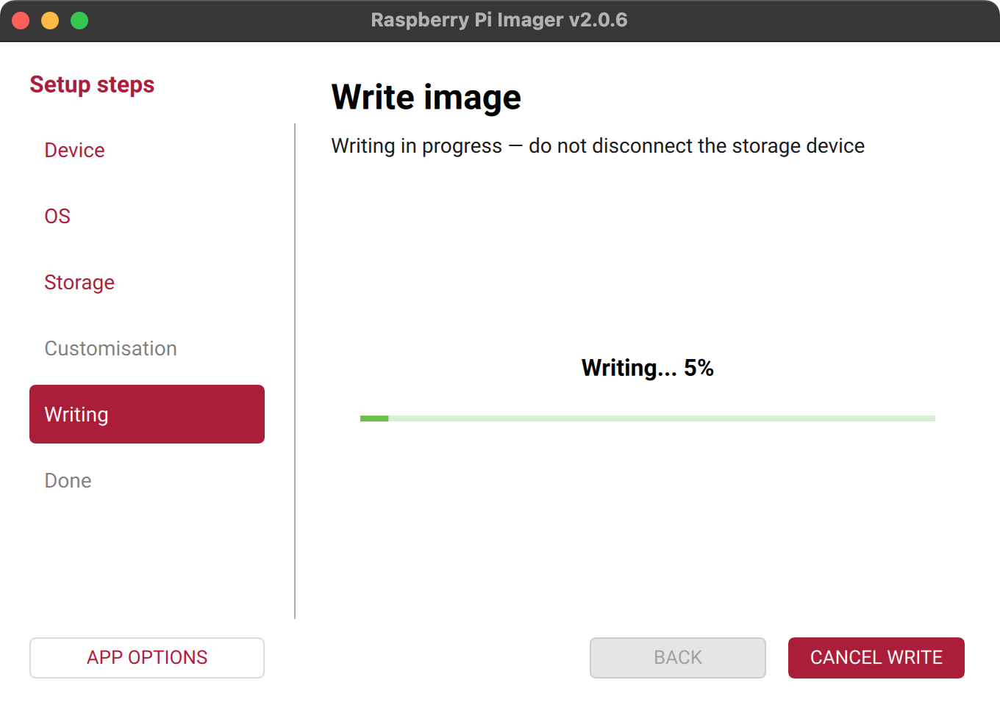

<!--
Title: How to run Superbacked OS on Raspberry Pi
Description: Learn how to run Superbacked OS on Raspberry Pi
Publication date: 2026-01-29T17:55:21.467Z
Pinned: 2
-->

## Requirements

- Raspberry Pi [4](https://www.raspberrypi.com/products/raspberry-pi-4-model-b/) or [5](https://www.raspberrypi.com/products/raspberry-pi-5/) (4GB min, 8GB or more recommended)
- Raspberry Pi [15W USB-C Power Supply](https://www.raspberrypi.com/products/type-c-power-supply/)
- Raspberry Pi [keyboard](https://www.raspberrypi.com/products/raspberry-pi-keyboard-and-hub/) and [mouse](https://www.raspberrypi.com/products/raspberry-pi-mouse/) (or equivalent)
- Raspberry Pi [Micro HDMI to Standard HDMI (A/M) Cable](https://www.raspberrypi.com/products/micro-hdmi-to-standard-hdmi-a-cable/) (or equivalent)
- microSD card or USB flash drive (used to run Superbacked OS, 16GB min, faster is better)
- Plug-and-play webcam with USB-A connector (1080p min)
- HDMI display (1080p min)

## Recommendations (optional)

Running Superbacked OS on flash drive with signed firmware and write protection enabled such as [Kanguru FlashTrust™ Secure Firmware USB 3.0 Flash Drive (WP-KFT3-16G)](https://www.kanguru.com/products/kanguru-flashtrust-secure-firmware-usb-3-0-flash-drive) is recommended.

## Superbacked OS microSD or USB flash drive guide

### Step 1: install [Raspberry Pi Imager](https://www.raspberrypi.com/software/)

#### macOS or Windows

Go to https://www.raspberrypi.com/software/, download and install Raspberry Pi Imager.

#### Ubuntu

> Heads-up: depends on [Qt](https://www.qt.io/).

```shell-session
$ sudo add-apt-repository --yes universe

$ sudo apt install --yes rpi-imager
```

### Step 2 (optional): opt out of Raspberry Pi Imager [telemetry](https://github.com/raspberrypi/rpi-imager#opting-out)

Select “App Options”, disable “Enable anonymous statistics (telemetry) collection” and click “Save”.

### Step 3: download Superbacked OS

> Heads-up: for additional security, [verify](https://github.com/superbacked/superbacked?tab=readme-ov-file#how-to-verify-integrity-of-release) Superbacked OS release.

#### macOS or Ubuntu

```shell-session
$ cd ~/Downloads

$ for number in $(seq 1 2); do curl --fail --location "https://github.com/superbacked/superbacked/releases/download/v${latestRelease}/superbacked-os-arm64-raspi-${latestRelease}.img.xz.part$number" || break; done | cat > superbacked-os-arm64-raspi-${latestRelease}.img.xz
```

#### Windows

> Heads-up: requires WSL to be [installed](https://learn.microsoft.com/en-us/windows/wsl/install) first using `wsl --install` (if applicable).

> Heads-up: replace `Sun Knudsen` with your username.

```shell-session
$ wsl

$ cd /mnt/c/Users/Sun\ Knudsen/Downloads

$ for number in $(seq 1 2); do curl --fail --location "https://github.com/superbacked/superbacked/releases/download/v${latestRelease}/superbacked-os-arm64-raspi-${latestRelease}.img.xz.part$number" || break; done | cat > superbacked-os-arm64-raspi-${latestRelease}.img.xz
```

### Step 4: copy Superbacked OS to microSD or USB flash drive

Open “Raspberry Pi Imager”, click “OS”, then “Use custom”, select `superbacked-os-amd64-${latestRelease}.img.xz`, click “Storage”, select microSD or USB flash drive, click “NEXT”, then “WRITE” and, finally, click “I UNDERSTAND, ERASE AND WRITE”.



### Step 5 (optional): enable write protection

If using Kanguru FlashTrust™ Secure Firmware USB 3.0 Flash Drive or equivalent, enable write protection.

## Usage guide

### Step 1 (if applicable): unplug Ethernet cable

### Step 2: boot Superbacked OS

> Heads-up: password is “superbacked”.

If scanning blocks does not work, please try using a higher quality 1080p webcam such as the [Razer Kiyo X](https://www.razer.com/streaming-cameras/razer-kiyo-x).
